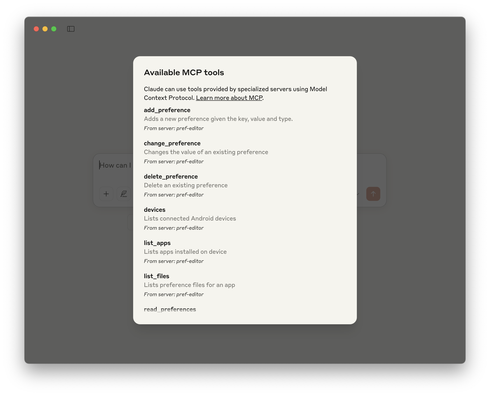

# Android-Preference-Editor MCP Server

<a href="https://glama.ai/mcp/servers/@charlesmuchene/pref-editor-mcp-server">
  
</a>

## Overview

The _Android-Preference-Editor MCP Server_ is a natural language interface designed for agentic applications to edit Android user preferences during app development. The implementation is based on the [Android Preference Editor](https://github.com/charlesmuchene/pref-editor-js.git) library.
This server integrates seamlessly with **MCP (Model Context Protocol) clients**, enabling AI-driven workflows during Android app development.
Using this MCP, you can give instructions like:

- "Toggle the **isVisited** user preference"
- "List the connected devices"
- "What apps are installed on device?"
- "Show me all the user preferences in the app"
- "Add a _lastTimeStamp_ user preference with the value of the current milliseconds since epoch"

## Tools

| Name              | Description                                           |
| ----------------- | ----------------------------------------------------- |
| change_preference | Changes the value of an existing preference           |
| delete_preference | Delete an existing preference                         |
| add_preference    | Adds a new preference given the name, value and type. |
| devices           | Lists connected Android devices                       |
| list_apps         | Lists apps installed on device                        |
| list_files        | Lists preference files for an app                     |
| read_preferences  | Reads all user preferences in a file                  |

## Demo

| Toggle a user preference                            | Available tools                              |
| --------------------------------------------------- | -------------------------------------------- |
|  |  |

> See more demo screenshots [here](./demo/)

## Requirements

- Android [adb](https://developer.android.com/tools/adb) installed on the host system.

## Integration with Claude Desktop

You can configure Claude Desktop to use this MCP server by adding the following in the `claude_desktop_config.json` configuration file.

```json
{
  "mcpServers": {
    "pref-editor": {
      "command": "npx",
      "args": ["@charlesmuchene/pref-editor-mcp-server"]
    }
  }
}
```

### Troubleshooting

You can troubleshoot problems by tailing the log file:

```sh
tail -f ~/Library/Logs/Claude/mcp-server-pref-editor.log
```

## Integration with VS Code

To use the server with VS Code, you need to:

1. Enable the [agent mode](https://code.visualstudio.com/docs/copilot/chat/chat-agent-mode) tools. Add the following to your `settings.json`:

```json
{
  "chat.agent.enabled": true
}
```

1. Add the MCP Server configuration to your `mcp.json` or `settings.json`:

```json
// .vscode/mcp.json
{
  "servers": {
    "pref-editor": {
      "type": "stdio",
      "command": "npx",
      "args": ["@charlesmuchene/pref-editor-mcp-server"]
    }
  }
}
```

```json
// settings.json
{
  "mcp": {
    "pref-editor": {
      "type": "stdio",
      "command": "npx",
      "args": ["@charlesmuchene/pref-editor-mcp-server"]
    }
  }
}
```

For more information, see the [VS Code documentation](https://code.visualstudio.com/docs/copilot/chat/mcp-servers).

## Installation

```sh
# Clone the repository
git clone https://github.com/charlesmuchene/pref-editor-mcp-server.git
cd pref-editor-mcp-server

# Install dependencies and build
npm install
```

## Testing

You can use the [MCP Inspector](https://modelcontextprotocol.io/docs/tools/inspector) for visual debugging of this MCP Server.

```sh
npx @modelcontextprotocol/inspector npm run dev
```

## License

See [LICENSE](./LICENSE)

## Contact

For questions or support, reach out via [GitHub Issues](https://github.com/charlesmuchene/pref-editor-mcp-server/issues).
