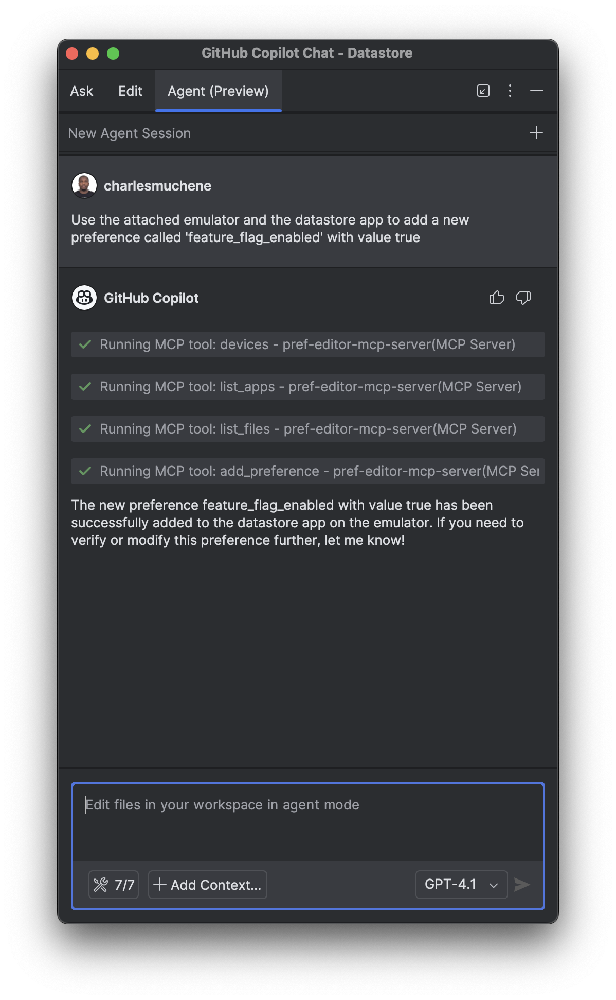

[](https://mseep.ai/app/charlesmuchene-pref-editor-mcp-server)

# Android-Preference-Editor MCP Server



Related post: <https://charlesmuchene.com/pref-editor-how-to-modify-android-preferences-in-real-time-during-development>

## Overview

Unlock the power of natural language for Android app development with the _Android-Preference-Editor MCP Server_. Effortlessly edit user preferences in real time using simple, conversational commands—no manual file editing required! Built on the robust [Android Preference Editor](https://github.com/charlesmuchene/pref-editor-js) library, this server seamlessly connects with **MCP (Model Context Protocol) clients** to supercharge your AI-driven workflows.

Just tell the MCP server what you want to do, for example:

- “Toggle the _isVisited_ user preference”
- “Turn off the onboarding guide”
- “List all the user preference values”
- "Create a timestamp preference with the current epoch time"

Experience a smarter, faster way to manage Android preferences—just ask!

<a href="https://glama.ai/mcp/servers/@charlesmuchene/pref-editor-mcp-server">
  
</a>

## Available Tools

| Name              | Description                                           |
| ----------------- | ----------------------------------------------------- |
| change_preference | Changes the value of an existing preference           |
| delete_preference | Delete an existing preference                         |
| add_preference    | Adds a new preference given the name, value and type. |
| read_preferences  | Reads all user preferences in a file                  |
| devices           | Lists connected Android devices                       |
| list_apps         | Lists apps installed on device                        |
| list_files        | Lists preference files for an app                     |

## Demo

| Toggle a user preference                            | Available tools                              |
| --------------------------------------------------- | -------------------------------------------- |
|  |  |

> See more demos in the [demo screenshots directory](./demo/)

## Requirements

- Android [adb](https://developer.android.com/tools/adb)
- Node.js 14+ or Docker

## Installation

```sh
 npm install -g @charlesmuchene/pref-editor-mcp-server

 OR

 docker pull charlesmuchene/pref-editor-mcp-server
```

## Integrations

### Android Studio

> Assumes Github copilot Intellij plugin is installed

Open the `~/.config/github-copilot/intellij/mcp.json` and add the following configuration:

```json
{
  "servers": {
    "pref-editor": {
      "type": "stdio",
      "command": "docker",
      "args": ["charlesmuchene/pref-editor-mcp-server"]
    }
  }
}
```

Or using `npx`

```json
{
  "servers": {
    "pref-editor": {
      "type": "stdio",
      "command": "npx",
      "args": ["@charlesmuchene/pref-editor-mcp-server"]
    }
  }
}
```

Launch copilot chat in Agent mode and type away!

### Claude Desktop

You can configure Claude Desktop to use this MCP server by adding the following in the `claude_desktop_config.json` configuration file.

```json
{
  "mcpServers": {
    "pref-editor": {
      "command": "npx",
      "args": ["@charlesmuchene/pref-editor-mcp-server"]
    }
  }
}
```

You can troubleshoot problems by tailing the log file:

```sh
tail -f ~/Library/Logs/Claude/mcp-server-pref-editor.log
```

### VS Code

To use the server with VS Code, you need to:

1. Add the MCP Server configuration to your `mcp.json` or `settings.json`:

```json
// .vscode/mcp.json
{
  "servers": {
    "pref-editor": {
      "type": "stdio",
      "command": "npx",
      "args": ["@charlesmuchene/pref-editor-mcp-server"]
    }
  }
}
```

```json
// settings.json
{
  "mcp": {
    "pref-editor": {
      "type": "stdio",
      "command": "npx",
      "args": ["@charlesmuchene/pref-editor-mcp-server"]
    }
  }
}
```

For more information, see the [VS Code documentation](https://code.visualstudio.com/docs/copilot/chat/mcp-servers).

## Building Locally

```sh
docker run -it --rm --name pref-editor charlesmuchene/pref-editor-mcp-server
```

OR

```sh
# Clone the repository
git clone https://github.com/charlesmuchene/pref-editor-mcp-server.git
cd pref-editor-mcp-server

# Install dependencies and build
npm install
```

## Testing

You can use the [MCP Inspector](https://modelcontextprotocol.io/docs/tools/inspector) for visual debugging of this MCP Server.

```sh
npx @modelcontextprotocol/inspector npm run dev
```

## License

See [LICENSE](./LICENSE)

## Contact

For questions or support, reach out via [GitHub Issues](https://github.com/charlesmuchene/pref-editor-mcp-server/issues).
